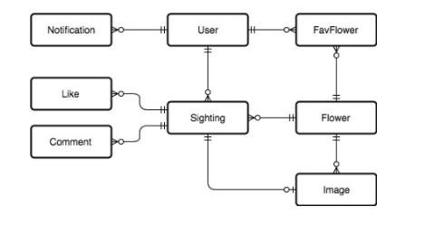

# FlowrSpot API (test build)

## General

- This API is the backend for the FlowerSpot app.
- Users can browser Flowers, read their descriptions and see how they look like.
 Like a flower wikipedia.
- Users can also favourite a given flower.
- Users then go on a hike or on a walk, and when they spot a flower, they can
submit a sighting. The sighting contains which user, which flower, description
where can it be found (next to the second tree on the left for example), their
 GPS location (lat, long) and the picture.
- Other users can like and comment on the sighting.
- Browsing Flowers, Sightings does not require authentication.
- Actions like submitting sightings, liking, commenting, favouriting
do require authentication.

## Features

### Required
- Login / Register
- Show latest sightings
- Show flowers
- Show flower and its sightings
- Search for flowers by name and latin name
- Post sightings
- Comment on sighting
- Like sighting
- Favourite a flower
- View favourite flowers
- Pagination on all endpoints that return a list
- Communication between mobile app and api must be via JWT (Json Web Token)
- Endpoints return results in JSON format
- RSpec test must cover close to 90% of the endpoints if possible
- Rubocop must pass

### Optional
- Complete active admin to see users, flowers (favorites), sightings (likes, comments)
- Search for flowers by location (nearby)
- Get notification for comment and like on your sighting
- Get notification for a new sighting of your favourite flower
- Get a notification for a new sighting of your favourite flower nearby
- Notifications must be via Firebase Cloud Message (add field ‘fcm_token’ in users table)

## Info

1. This project was build with Ruby 2.3.4 & Rails 5.1.4.
1. Copy .env.sample to .env file and modify if necessary.
1. Modify the database.yml file
1. Create the database together with the migrations.
1. Run `rake db:test:prepare` and to run `rspec spec` to run the tests (they will fail, read further down the assigment)
1. We are using JWT for Authentication, which needs to be implemented.
1. For tests we have RSpec and a modified file to run Rubocop to check the code.

## Assigment

### Complete JWT authentication
1. complete the jwt authentication for the api calls in order to continue

### Create rescue handlers for 
1. RecordNotFound - to return 404 with json `{error: exception.message}`
1. ParameterMissing - to return 400 with json `{error: exception.message}`

### Fix existing controllers
1. run RSpec and fix controllers so that the test pass.

### Create Flowers endpoint
1. create a `POST /flowers` create method in flowers controller
1. write a test that tests this method

### Create Likes, Comments for Sightings
1. as a user i can like other and my sightings
1. as a user i can comment other and my sightings

### Create Favourites
1. as a user i can favourite any flower
1. as a user i can see all the flowers i favourited

### Background worker
1. a worker that triggers once per day and sends how many users are there in total,
how many sightings in total, how many favorites in total

### Check required features
1. check if all required features are covered mentined in the Features -> Required section.

<b>Upon completion deploy to your GitHub account for review. We will clone
your repo, run it locally, run the tests, review git commits and
the code structure.</b>
